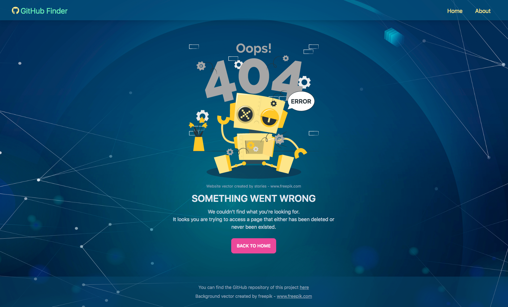
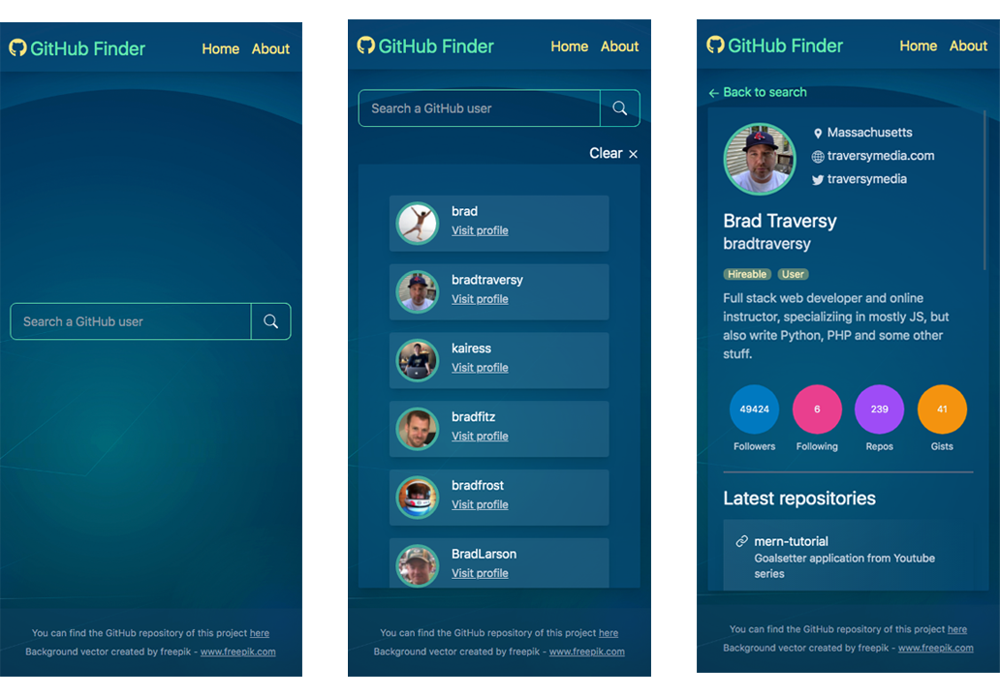

# GitHub Search Users

[](https://www.javascript.com)
[](https://reactjs.org/)
[](https://www.npmjs.com/package/npm/v/8.1.2)
[](https://www.npmjs.com/package/npm/v/8.1.2)
[](https://github.com/rosgas/react-github-finder/blob/master/LICENSE)

<br>

> **React** application which searches GitHub for users by username and displays the results on the screen. Clicking on a specific user will show all the details related to that user. <br>
> This app uses the **Context API** along with the **useContext** and **useReducer hooks** for state management.

<br>


<br>
<br>

## Table of Contents

- <a href="#features-section">Description</a>
- <a href="#live-demo-section">Live Demo</a>
- <a href="#technologies-section">Technologies used</a>
- <a href="#react-section">React folder structure</a>
- <a href="#setup-section">Installation/Usage</a>
- <a href="#acknowledgments-section">Acknowledgments</a>

<br>

<h2 id="futures-section">Description</h2>

This app uses the **GitHub API**. You can find the documentation for this API [here](https://docs.github.com/en/rest). This is an **open API**: no API key or authentication is required for the used endpoints.

- The **UserSearch.jsx** file has a form with a search input. When the form is submitted, it takes the value of the input and searches GitHub for user matches using the **User Search Endpoint** (example, if we wanted to find all users named octocat, a GET request is made to https://api.github.com/search/users?q=octocat)

  The user search bar is implemented with:

  - a little **alert** that shows up if the field is left empty
  - a clear button that appears as soon as you type something

- Using the results of the search, basic information about the users are displayed on the page, including their username, avatar and a link to their profile.

  The table with user cards is implemented with a clear button to
  clear the search results.

- Clicking on one of these users a request to the GitHub API is sent, to fetch more information of the selected user (ex: bio, blog, followers, following, etc) and its latest repositories.

  Using the response, user and latest repositories information  
  are displayed on the page.

- Extra pages:

  - Simple **About page**
  - **Error 404 page**

  <br>

  

- **Responsive** on all devices;

  Mobile preview:



<br>

<br>

<h2 id="live-demo-section">Live demo</h2>

[Check out the demo page](https://react-github-finder-delta.vercel.app/)

<br>

<h2 id="technologies-section">Technologies used</h2>

- **React**:
  - **React router**
  - **useContext hook**
  - **useReducer hook**
- **Tailwind** as a CSS framework to build the user interfaces
- **DaisyUI** to have higher level of classes for components
- **Framer Motion** for animations and transitions
- **Vercel** as a plataform to deploy the application

<br>

<h2 id="react-section">React folder structure</h2>

```
├── node_modules
├── public
│   ├── favicon.ico
│   ├── index.html
│   └── manifest.json
├── src
│   ├── components
│   │   ├── assets
│   │   │   ├── main-bg.png
│   │   │   ├── not-found.png
│   │   │   ├── octocat.png
│   │   │   └── spinner.gif
│   │   ├── layout
│   │   │   ├── Alert.jsx
│   │   │   ├── Footer.jsx
│   │   │   ├── Navbar.jsx
│   │   │   └── Spinnner.jsx
│   │   ├── repos
│   │   │   ├── RepoItem.jsx
│   │   │   └── RepoList.jsx
│   │   ├── users
│   │   │   ├── UserItem.jsx
│   │   │   ├── UserSearch.jsx
│   │   │   └── UserResults.jsx
│   ├── context
│   │   ├── alert
│   │   │   ├── AlertContext.js
│   │   │   └── AlertReducer.js
│   │   ├── github
│   │   │   ├── GitHubAction.js
│   │   │   ├── GitHubContext.js
│   │   │   └── GitHubReducers.js
│   ├── pages
│   │   ├── About.jsx
│   │   ├── Home.jsx
│   │   ├── NotFound.jsx
│   │   └── User.jsx
│   ├── App.js
│   ├── index.css
│   ├── index.js
├── .gitignore
├── package-lock.json
├── package.json
├── postcss.config.js
├── README.md
└── tailwind.config.js

```

<h2 id="setup-section">Installation/Usage</h2>

**1. Clone this repo:**

```
git clone https://github.com/rosgas/react-github-finder.git
```

**2. Installation**

```
npm install
```

**3. Then run**

After all dependencies have been installed you can run the app locally in development mode or you can built out the static assets to deploy them on any webserver.

- **Run the app in development mode**

  After installing all dependencies you can run the app on the webpack dev server by running the following command:

  ```
  npm start
  ```

  Open http://localhost:3000 to view it in the browser.

- **Build a deployment-ready production build**

  Run this command to build out all of the static assets required for a production deployment:

  ```
  npm run build
  ```

  <br>

You can learn more in the [Create React App documentation.](https://create-react-app.dev/docs/getting-started/)

<br>

<h2 id="license-section">License</h2>

This project is licensed under the [MIT License](https://github.com/rosgas/react-github-finder/blob/master/LICENSE).

<br>

<h2 id="acknowledgments-section">Acknowledgments</h2>

- [Traversy Media](https://www.traversymedia.com/)
